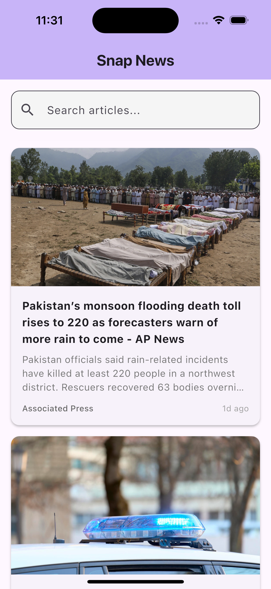

# SnapNews

A modern Flutter application for browsing and reading the latest news articles from various sources.

## Features

- **Latest News**: Browse through the most recent news articles from various sources
- **Search Functionality**: Search for specific news topics or keywords
- **Article Details**: View detailed information about each article including source, author, and publication date
- **External Browser Integration**: Open full articles in your default browser
- **Offline Support**: Cache articles for offline reading
- **Pull-to-Refresh**: Update news feed with the latest articles
- **Responsive UI**: Clean and intuitive user interface that works across different device sizes

## Technical Overview

### Architecture

The app follows a Provider pattern for state management with a clean separation of concerns:

- **Models**: Data structures representing news articles
- **Providers**: State management for news data
- **Services**: API communication and local storage
- **Screens**: User interface components
- **Widgets**: Reusable UI elements

### Key Components

- **NewsProvider**: Manages the state of news articles, including loading, filtering, and error handling
- **NewsService**: Handles API communication with the NewsAPI service
- **StorageService**: Manages local caching of articles using SharedPreferences
- **Article Model**: Represents news article data structure

### Dependencies

- **provider**: For state management
- **http**: For API requests
- **shared_preferences**: For local storage
- **cached_network_image**: For efficient image loading and caching
- **url_launcher**: For opening articles in external browser
- **intl**: For date formatting
- **flutter_dotenv**: For environment variable management

## Screenshots

### Home Screen
<p align="left">
  
</p>

### Detailed Screen
<p align="left">
  
</p>

### Search Result
<p align="left">
  
</p>


## Getting Started

### Prerequisites

- Flutter SDK (version 3.8.1 or higher)
- Dart SDK (compatible with Flutter version)
- NewsAPI API key

### Setup

1. Clone the repository
2. Create a `.env` file in the root directory with your NewsAPI key:
   ```
   API_KEY=your_newsapi_key_here
   ```
3. Install dependencies:
   ```bash
   flutter pub get
   ```
4. Run the app:
   ```bash
   flutter run
   ```

## Project Structure

```
lib/
├── main.dart            # Application entry point
├── models/
│   └── article.dart     # Article data model
├── provider/
│   └── news_provider.dart # State management
├── screens/
│   ├── article_detail_screen.dart # Article detail view
│   └── home_screen.dart  # Main news listing screen
├── services/
│   ├── news_service.dart # API communication
│   └── storage_service.dart # Local storage handling
└── widgets/
    ├── article_card.dart # Article preview card
    └── search_bar_widget.dart # Search functionality
```

## API Integration

The app uses the [NewsAPI](https://newsapi.org/) service to fetch news articles. You'll need to sign up for an API key and add it to your `.env` file.

